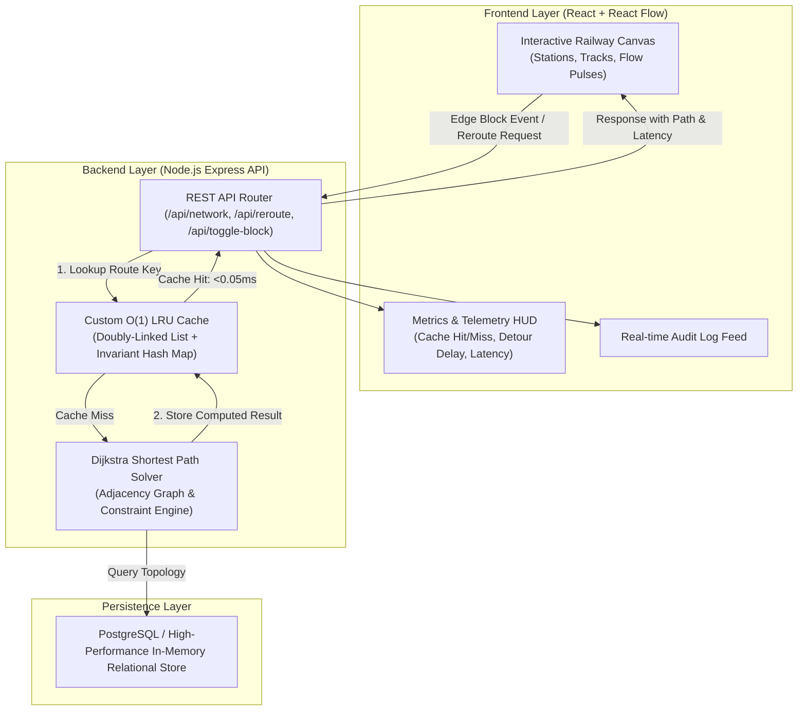

# Railway Network Block Planner & Dynamic Rerouting Engine

[](https://nodejs.org/)
[](https://reactflow.dev/)
[](https://expressjs.com/)
[](https://www.postgresql.org/)
[](LICENSE)

An intelligent, real-time railway network graph visualization and constraint-aware dynamic rerouting engine. The system models railway infrastructure as a digital twin, simulates track maintenance blocks (originating from TMS, SMMS, and TDMS systems), and calculates conflict-free optimal detour routes with sub-millisecond in-memory cache acceleration.

---

## 📌 System Capabilities

- **Interactive Railway Network Digital Twin**: Visualizes stations (nodes) and track segments (edges) on an interactive canvas powered by React Flow with real-time speed limits, double-track flags, and section running times.
- **Dynamic Constraint Graph Routing**: Computes shortest conflict-free paths using Dijkstra's algorithm with dynamic edge exclusion matrices, accounting for speed limits and section travel times.
- **$O(1)$ LRU Fallback Cache**: High-performance custom doubly-linked list cache with invariant canonical key hashing. Serves frequent recurring block scenarios in $<0.05\text{ms}$ directly from memory without graph recalculations.
- **Integrated Indian Railways Dataset**: Pre-loaded with the **Northern / North Central Railway (NCR) High-Density Golden Quadrilateral Corridor** (`NDLS` → `GZB` → `ALJN` → `TDL` → `CNB` with `MB-BYP` and `LKO-CHD` bypass routes).
- **Multi-System Maintenance Ingestion**: Supports real-time maintenance feeds from:
  - **TMS** (Train Management System) — Signal and interlocking failures.
  - **SMMS** (Smart Maintenance Management System) — Ultrasonic flaw detection and track geometry repairs.
  - **TDMS** (Track Deterioration Management System) — Catenary tensioning, tamping, and ballast screening.
- **Live Telemetry & Audit Trail**: Real-time HUD displaying cache hit rates, calculation latency, detour penalties, and a streaming audit log.

---

## 🏛️ System Architecture



---

## 🚆 Real-World Railway Topology (NCR Corridor)

| Station Name | Code | Station Role | Position / Segment |
| :--- | :--- | :--- | :--- |
| **New Delhi** | `NDLS` | Origin Terminal | Western Corridor Terminal |
| **Ghaziabad Junction** | `GZB` | Major Junction | Quad-track bifurcation point |
| **Aligarh Junction** | `ALJN` | High-Speed Junction | Main Grand Trunk Corridor |
| **Moradabad Bypass Loop** | `MB-BYP` | Alternate Loop | Northern Bypass Corridor |
| **Tundla Junction (Agra)** | `TDL` | Major Junction | High-speed link to Kanpur |
| **Bareilly-Lucknow Chord** | `LKO-CHD` | Chord Line | Southern Freight & Express Alternate |
| **Kanpur Central** | `CNB` | Destination Terminal | Eastern Corridor Gateway |

---

## ⚡ Tech Stack

| Component | Technology | Description |
| :--- | :--- | :--- |
| **Frontend** | React 18, React Flow (`@xyflow/react`), Tailwind CSS, Lucide Icons | Reactive railway map canvas, dynamic route animations, and responsive controls. |
| **Backend** | Node.js, Express.js | Modular RESTful API routing, graph adjacency parsing, and maintenance simulation. |
| **Optimization** | Custom Doubly-Linked List LRU Cache | $O(1)$ fast get/put operations with telemetry tracking and canonical key hashing. |
| **Database** | PostgreSQL (`pg`), Embedded In-Memory Fallback | Relational storage for nodes, edges, speed restrictions, and maintenance schedules. |

---

## 📡 REST API Reference

### 1. `GET /api/network`
Retrieves the complete railway network graph, stations, track segments, active blocks, and maintenance tasks.

```json
{
  "success": true,
  "currentDataset": "real_ir",
  "nodes": [...],
  "edges": [...],
  "blockedEdgeIds": [],
  "maintenance": [...],
  "baselineRoute": {
    "found": true,
    "path": [101, 102, 103, 105, 107],
    "pathNames": ["New Delhi", "Ghaziabad Junction", "Aligarh Junction", "Tundla Junction (Agra)", "Kanpur Central"],
    "travelTime": 255,
    "executionTimeMs": 0.025
  },
  "cacheStats": { "size": 2, "capacity": 100, "hits": 10, "misses": 2, "hitRate": "83.3%" }
}
```

### 2. `POST /api/reroute`
Calculates optimal conflict-free routes considering blocked track constraints.

**Request Body:**
```json
{
  "source": 101,
  "target": 107,
  "blocked_edge_ids": [202]
}
```

**Response:**
```json
{
  "success": true,
  "cacheHit": true,
  "cacheKey": "route:101->107|blocked:[202]",
  "dataSource": "LRU_IN_MEMORY_CACHE",
  "executionTimeMs": 0.026,
  "found": true,
  "path": [101, 102, 104, 106, 107],
  "pathNames": ["New Delhi", "Ghaziabad Junction", "Moradabad Bypass Loop", "Bareilly-Lucknow Chord", "Kanpur Central"],
  "travelTime": 325,
  "baselineTravelTime": 255,
  "detourDelay": 70
}
```

### 3. `POST /api/toggle-block`
Toggles track maintenance state on an edge segment.

```json
{ "edgeId": 202, "isBlocked": true }
```

### 4. `POST /api/switch-dataset`
Switches active network topology between `'real_ir'` (NCR Delhi-Kanpur) and `'demo'` (5-node sample).

```json
{ "dataset": "real_ir" }
```

### 5. `GET /api/cache-stats` & `POST /api/cache-clear`
Telemetry endpoints for monitoring cache hit ratio, eviction counts, and memory clearing.

---

## 🚀 Installation & Local Setup

### Prerequisites
- **Node.js**: v18.0.0 or higher
- **npm**: v9.0.0 or higher
- **PostgreSQL** *(Optional)*: If not present, the system defaults automatically to the embedded relational store.

### 1. Clone the Repository
```bash
git clone https://github.com/YOUR_USERNAME/sih-block-planner.git
cd sih-block-planner
```

### 2. Install Dependencies & Build
```bash
# Install backend and frontend dependencies, then build frontend bundle
npm run render-build
```

### 3. Start the Application
```bash
npm start
```
The unified application will be available at: **`http://localhost:5000`**

---

## ☁️ Deployment Guide (Render.com)

The project includes a root [`render.yaml`](render.yaml) specification designed for single-service deployment.

### 1-Click Setup via Render Dashboard
1. Create a new **Web Service** on [Render Dashboard](https://dashboard.render.com).
2. Link your GitHub repository.
3. Configure the settings:
   - **Environment:** `Node`
   - **Build Command:** `npm run render-build`
   - **Start Command:** `npm run start`
   - **Plan:** `Free`
4. Set Environment Variables:
   - `NODE_ENV` = `production`
   - `PORT` = `5000`
   - `CACHE_CAPACITY` = `100`
5. Deploy the service.

---

## 🗄️ Database Schema (`schema.sql`)

```sql
CREATE TABLE nodes (
  id SERIAL PRIMARY KEY,
  name VARCHAR(100) NOT NULL,
  code VARCHAR(10) NOT NULL,
  x INT DEFAULT 0,
  y INT DEFAULT 0,
  type VARCHAR(30) DEFAULT 'station'
);

CREATE TABLE edges (
  id SERIAL PRIMARY KEY,
  source INT REFERENCES nodes(id) ON DELETE CASCADE,
  target INT REFERENCES nodes(id) ON DELETE CASCADE,
  travel_time INT NOT NULL,
  track_name VARCHAR(100),
  speed_limit INT DEFAULT 110,
  is_double_track BOOLEAN DEFAULT TRUE,
  is_blocked BOOLEAN DEFAULT FALSE
);

CREATE TABLE maintenance_requests (
  id SERIAL PRIMARY KEY,
  system_source VARCHAR(20) NOT NULL, -- 'TMS', 'SMMS', 'TDMS'
  edge_id INT REFERENCES edges(id),
  title VARCHAR(150) NOT NULL,
  reason VARCHAR(255) NOT NULL,
  severity VARCHAR(20) NOT NULL, -- 'CRITICAL', 'HIGH', 'SCHEDULED'
  status VARCHAR(20) DEFAULT 'ACTIVE',
  duration_mins INT DEFAULT 120,
  created_at TIMESTAMP DEFAULT CURRENT_TIMESTAMP
);
```

---

## 📄 License

This project is open-source software licensed under the [MIT License](LICENSE).
